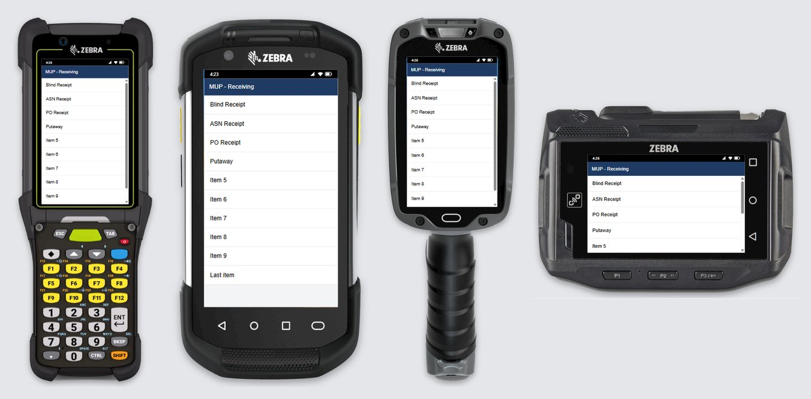

# Device Frame – User Guide

Device Frame is a Chrome extension that shows a web page inside a phone,
handheld, laptop, or plain screen, so you can demo it, take screenshots, and
record videos. It replaces the device frame Chrome DevTools used to have.


---

## 1. Install

1. Download the latest zip:
   **https://github.com/sidmsmith/device-frame-extension/releases/latest/download/device_frame_extension.zip**
2. Extract it to a permanent folder **outside OneDrive**, e.g.
   `C:\Users\<your name>\device_frame_extension`. Check that `manifest.json`
   is directly inside that folder.
3. In Chrome, open `chrome://extensions` and turn on **Developer mode** (top right).
4. Click **Load unpacked** and select the folder.
5. Pin **Device Frame** from the puzzle-piece menu so its phone icon is in the toolbar.
6. Press **F5** on any tabs that were already open (see section 9).

### Updating to a new version

You don't need to remove the extension or use **Load unpacked** again – just
replace the files and reload:

1. Download the latest zip (same link as above).
2. Extract it **into the same folder you installed from**, replacing the
   existing files. Watch the folder name: if Chrome saved the download as
   `device_frame_extension (1).zip`, Windows will suggest extracting to
   `device_frame_extension (1)` – change it back to your original
   `device_frame_extension` folder, or the old version keeps running.
3. Check that `manifest.json` is still directly inside that folder (not in a
   new subfolder).
4. Open `chrome://extensions` and click the **Reload** icon (circular arrow)
   on the **Device Frame** card. The card shows the new version number.
5. Close any open frame windows and press **F5** on open tabs, so they pick
   up the new version.

## 2. Open a page in a frame

Go to the page you want to show (for WM Mobile: open **WM Mobile** from the
WMS menu), then click the **Device Frame** icon in the Chrome toolbar. A
separate window opens with the page inside the device. It works exactly like
the normal page: same login, same data.

The window remembers its position, device, and settings. Close the window
when you're done.

**Frame in this tab instead:** with **Open the frame in: This tab** (settings
panel), the icon frames the page right where it is, in its own tab and
window, instead of opening a new window. The window is resized to the device
just like a frame window (a normal window can't be quite as narrow, so a
narrow phone is centered with a little room on each side). Click the icon
again to remove the frame (the page reloads). This is for when another tool drives the tab – for example Claude
in Chrome, which can only work in its own tab group, not in a new window.

## 3. The control bar

| Icon | Name | What it does |
|---|---|---|
| *(dropdown)* | Device | Pick the device or screen size (see section 4). |
|  | Edit size | Shown when **Custom** is selected: change the custom width × height. |
|  | Delete | Shown when a **Saved** device is selected: click twice to delete it. |
|  | Rotate | Switch between portrait and landscape (phones and tablets only). |
|  /  | Status bar | Show / hide an Android status bar (clock, signal, Wi-Fi, battery). Slashed = hidden. |
|  | Settings | Background, frame color, tap indicator, recording options, language (see section 5). |
|  | Reload | Reload the page (F5 also works). |
|  /  | Record | Record a video (see section 7): circle = **Device only**, screen = **Entire screen** (chosen in Settings). Turns red with a timer while recording; click again to stop. |
|  | Screenshot | Picture of the device: copied to the clipboard **and** saved to Downloads (see section 6). |
|  | Hide toolbar | Hide this bar for a clean screen (see section 8). |

Hover over any button to see a short description. This guide is also one
click away: **Settings**  → **? User Guide**.

## 4. Devices and screen sizes

The device dropdown has three sections:

- **Mobile** – Android Tablet, Galaxy S24, Moto G4, Pixel 8, and four Zebra
  devices shown with real product photos:
  - **Zebra MC9400** (320×533) – gun-style computer with a full keypad.
  - **Zebra TC72** (360×640) – rugged touch computer.
  - **Zebra TC8300** (320×533) – touch computer with a pistol grip.
  - **Zebra WT6300** (512×320) – wrist-worn, landscape only.
- **Full Screen** – for laptop/PC/fixed-station screens:
  - **Desktop (no frame, 1920×1080)** – just the screen, no frame at all.
    Use this to record or screenshot normal desktop WMS screens.
  - **Kiosk (1920×1080)** – a thin-bezel display on a short aluminum stand.
  - **Laptop (1366×768)** – the page inside a laptop frame.
  - **Monitor (1920×1080)** – a thin-bezel display without a stand, the
    biggest framed view.
  - **Tablet Stand (1280×800)** – a tablet on a round desk stand.
- **Saved** – your own named sizes (only shown once you've saved one).

**Custom…** (at the bottom) lets you type any width × height (240–2560).
Press **Enter** or **Apply** to use it. To keep it for later, click **Save…**,
type a name (e.g. *Zebra TC21*), and press Enter – it appears under **Saved**.

Good to know:

- The numbers are the screen size the page sees (like DevTools), not physical pixels.
- If a device is bigger than your monitor, the window automatically zooms
  out to fit. The page still lays out at the full size.
- Full Screen devices are always landscape and have no status bar, so those
  buttons are grayed out.

**Maximize for the biggest view:** maximize the frame window (or press **F11**
for full screen; F11 or Esc to exit). Full Screen devices then fill the
window edge to edge on any screen: the device screen grows wider or taller
to match the window's shape (the page sees that size, like a real display of
that shape). Phones and handhelds keep their real size and are centered.
Restore the window to go back to the normal size. F11 gives the most room,
since it also hides the window's title bar and the taskbar.

**Fitting pages to the device screen** (setting **Fit page to screen width**,
on by default – frame window only, normal tabs are never affected):

- Pages that are wider than the device screen are shrunk just enough to fit,
  so you don't have to scroll sideways. Screens that already fit stay at 100%.
- Sizes the page sets as a share of "the screen" (e.g. buttons 35% wide, or a
  full-height panel) are measured against the device screen, not the whole
  window – so footer buttons and full-height screens fit like on a real device.
- If a single word is too wide for its button (e.g. PERFORMANCE splitting onto
  two lines), the text is shrunk a little to keep it on one line, and the
  buttons next to it are shrunk by the same amount so they still match.
  Phrases like "INDIRECT EVENT" can still wrap between words.




## 5. Settings panel

Click  to open it; click anywhere else to close it.

- **Background** – Light gray (default), White, or Dark. This is the area
  around the device. Each chip shows its color; the selected one has a blue
  ring.
- **Frame color** – Black, Silver, White, Blue, or Manhattan. (The Zebra
  devices and Desktop keep their own look.)
- **Show taps** – shows a soft circle wherever you click, plus a round
  fingertip cursor. Great for screen-shared demos and recordings, so viewers
  can see what you tapped.
- **Fit page to screen width** – shrink too-wide pages and long words to fit
  the device screen (see section 4). Untick to see the page at its true size.
- **Always open with toolbar hidden** – on by default. Every new frame window
  starts with the toolbar hidden for a clean, demo-ready screen, no matter how
  you left it last time (see section 8 to show it). Untick it to have the
  window remember whether the toolbar was showing.
- **Open the frame in: New window / This tab** – New window (default) opens
  a separate frame window; This tab frames the current tab in place (see
  section 2).
- **Recording: Device only / Entire screen** – what the record button and
  **Alt+Shift+V** record: just the device (default), or everything on one
  screen, including other windows you switch to (see section 7).
- **Countdown before recording** – on by default: 3 seconds for Device only,
  5 seconds for Entire screen (time to hide Chrome's sharing bar). Untick to
  start recording immediately.
- **Record microphone** – include your voice in recordings (see section 7).
- **Skip loading screens (Device only)** – on by default. Pauses the
  recording while the app shows its loading message (WM Mobile's
  "Loading...."), so the wait is cut from the video (see section 7). If
  **Record microphone** is also on, this setting turns **bold red** as a
  reminder that anything you say during a loading screen is cut too.
- **Include computer sound (Entire screen)** – off by default. The sound your
  computer plays (videos, alerts), not your voice. When on, Chrome's screen
  picker offers **Also share system audio**; tick it there to include the
  sound.
- **Rename titles** and **Tab icon** – friendlier names and icons for browser tabs (see section 9).
- **Language** – the language of the toolbar, tooltips, settings and
  messages: English, Français (French) or Español (Spanish, Mexico).
  **Auto** (the default) follows Chrome's own language, and anything other
  than French or Spanish shows English. Chrome's own pages (the Extensions
  and Keyboard shortcuts pages) always follow Chrome's language. This guide
  is in English only.
- **? User Guide** – opens this guide in a new tab.

All settings are remembered. With more than one frame window open:

- **Each window keeps its own look:** device, rotation, background, frame
  color, status bar, show taps, fit to screen width, and whether the toolbar
  is hidden. A new window starts with the choices you made last.
- **Shared by all frame windows:** the recording settings (Device only or
  Entire screen, countdown, microphone, computer sound), rename titles, tab
  icon, language, and *Always open with toolbar hidden*. Changing one of
  these in any window updates them all.

## 6. Screenshots

- Click  – the device is **copied to the clipboard**
  and **saved to Downloads** as a PNG.
- Or press **Alt+Shift+S** – copies to the clipboard only (no file).

Screenshots have a **transparent background** (just the device), so they paste
cleanly into PowerPoint, Teams, or Outlook. Files are named after the device and
the time, e.g. `ZebraTC72_20261003141530.png`.

## 7. Recording videos

There are two kinds of recording; choose one under **Recording** in the
settings panel:

- **Device only** (default) – just the device, cropped from the frame window.
- **Entire screen** – everything on one screen, so you can **Alt+Tab** between
  windows (e.g. WM Mobile and the WMS desktop) to show before and after in one
  video. The record button shows a screen  instead of a circle.

### Device only

**Start:**
- Press **Alt+Shift+V** (recommended) – starts straight away, no prompt.
- Or click  – Chrome first asks you to share the tab; click **Share**.

A **3, 2, 1** countdown runs (unless you turned it off), then recording starts.
The record button turns red and shows the elapsed time.

**Stop:** press **Alt+Shift+V** again, or click the red  button.
The video is saved to **Downloads** as an **MP4** (plays in PowerPoint, Teams, Outlook),
named after the device and the time, e.g. `ZebraTC72_20261003141530.mp4`.

**Skipping loading screens** (setting **Skip loading screens**, on by
default): while WM Mobile shows its "Loading...." message, the recording
pauses and the red button shows ⏸; it continues a moment after the screen
appears. The saved video jumps straight from the screen before the wait to the
screen after it, and the timer counts recorded time only. Your narration
during the wait is cut too, so pause talking while it loads (or turn the
setting off).

**Pausing from the page:** another tool driving the tab can pause and resume
the recording by sending events to the page – for example Claude, while it
stops to ask you a question:
`window.dispatchEvent(new Event('device-frame-pause'))`, then
`device-frame-resume` (or `device-frame-stop` to stop and save). A pause
lasts until the resume, and the button shows ⏸ meanwhile. Starting a
recording always stays with you (the button or the shortcut).

Tips:

- Only the device is recorded – not the control bar.
- Turn on **Show taps** so viewers can see where you clicked (the mouse
  pointer itself isn't recorded).
- The video is a rectangle, so the **background color** shows in the corners
  around a phone. Pick the background that matches your slides (e.g. White)
  before recording. In PowerPoint you can also use **Video Format → Video
  Shape → Rounded Rectangle** to trim the corners.
- While recording, the device/rotate/settings/hide controls are locked so the
  video can't change size.
- A full page reload (e.g. logging in again) ends the recording; moving
  around inside the app is fine.

### Entire screen

1. Click  or press **Alt+Shift+V**. A small **Device Frame –
   screen recording** window opens with Chrome's **Choose what to share**
   picker. Pick the screen and click **Share**. (Chrome asks every time; with
   two monitors, pick the one you'll be working on.)
2. The small window minimizes itself so it isn't in the video, and a **5**
   second countdown runs in the frame window. Use it to click **Hide** on
   Chrome's "sharing your screen" bar at the bottom of the screen.
3. Recording starts. The record button in **every** frame window turns red and
   shows the time. Switch windows, apps or pages freely – the recording keeps
   going.
4. **Stop:** click the red button in any frame window, press **Alt+Shift+V**
   in any Chrome window, click **Stop sharing** on Chrome's bar, or click
   **Stop and save** in the minimized recording window.

The video is saved to **Downloads** as `FullScreen_20261003141530.mp4` (the
date and time), and the small window closes itself. Keep that window open
while recording (minimized is fine) – closing it stops the recording without
saving.

### Microphone

Tick **Record microphone** in the settings panel. The first
time, Chrome asks for microphone permission – choose **Allow on every visit**.
While recording with sound, a small  appears on the red button. If the
microphone is blocked or missing, you'll see a message and the video is
recorded without sound. For Entire screen recordings, the prompt appears in
the small recording window the first time.

## 8. Hiding the toolbar

New frame windows open with the toolbar **already hidden** (setting **Always
open with toolbar hidden**, on by default – untick it in the settings panel to
keep the toolbar showing). You can also click  to hide the bar at any time. To bring it back:

- **double-click** the device frame or the background around it,
- press **Alt+Shift+H**, or
- move the mouse to the top edge of the window and click the small tab  that appears.

## 9. Tab titles and icons

Some apps have unhelpful page titles (WM Mobile shows **MUP**). The
**Rename titles** box in the settings panel replaces them in the browser tab
and in the frame window's title bar. Put one rename per line, as
`Old title = New title`:

```
MUP = WM Mobile
Receiving = WM Receiving
WM Desktop* = Warehouse Management
# notes like this are ignored
```

- The whole title must match; capitals don't matter.
- End the old title with `*` to match titles that **start with** it
  (e.g. `WM Desktop*` also matches "WM Desktop - Receiving").
- The first matching line wins. Blank lines and lines starting with `#` are ignored.
- A line it can't read (no `=`) gets a red outline and is skipped.
- Changes are saved when you click outside the box and apply to open tabs
  straight away. The default list is `MUP = WM Mobile`.

**If a tab isn't renamed:** tabs that were already open when you installed or
updated the extension don't have it yet – press **F5** on that tab once.

### Tab icon

You can also replace the small icon shown in the tab and the frame window's
title bar. Under **Tab icon** in the settings panel:

- **Choose…** – pick an image (PNG, JPG, SVG, or ICO). It's shrunk to a small
  icon automatically.
- By default the icon is shown on **tabs renamed by your list** (e.g. the
  WM Mobile tab); every other tab keeps its own icon.
- **Always display in this window** – the frame window shows your icon for
  every page, renamed or not. (Normal tabs still only get it when renamed.)
- **Remove** – go back to each page's own icon.

## 10. Keyboard shortcuts

| Shortcut | Does |
|---|---|
| **Alt+Shift+V** | Start / stop recording (Device only: no share prompt; Entire screen: stops from any Chrome window) |
| **Alt+Shift+S** | Copy a screenshot to the clipboard |
| **Alt+Shift+H** | Hide / show the toolbar |

Shortcuts only act in the frame window. To change them, go to
`chrome://extensions/shortcuts`. (Avoid **Alt+Shift+R** – Chrome uses it for
Reading mode.)

## 11. Troubleshooting

| Problem | Fix |
|---|---|
| "Manifest file is missing or unreadable" when loading | Select the folder that has `manifest.json` directly inside it (not a parent folder), and keep it **outside OneDrive**. |
| Clicking the toolbar icon does nothing | It only works on normal web pages (`http`/`https`), not on `chrome://` pages. |
| A shortcut does nothing | Check `chrome://extensions/shortcuts` – Chrome sometimes leaves a new shortcut blank; set it there. |
| A shortcut types a letter into the page | Close the frame window and open it again (needed once after installing or updating). |
| A tab title or icon isn't changed | Press **F5** on that tab (tabs open before installing/updating need one refresh). Check the old title in the list matches the page's title. |
| "Screen recording stopped: its window was closed" | The small recording window was closed. Leave it open (minimized is fine) until you stop recording. |
| The extension isn't shown in an Incognito window | `chrome://extensions` → **Details** on Device Frame → turn on **Allow in Incognito**. Frame windows opened from Incognito stay in Incognito (same sign-in). |
| Still the old version after updating | The zip was probably extracted to a new folder like `device_frame_extension (1)`. Extract into your original folder and click **Reload** on the extension card. |
| "Recording failed: …" | Try the record button instead of the shortcut, and send the message text to whoever maintains the extension. |
| "Clipboard copy blocked" | The PNG was still saved to Downloads. Click inside the frame window first, then try again. |
| A strange text-only view appeared | That's Chrome's Reading mode (Alt+Shift+R) – click the ✕ to close it. |

## 12. Release History

Newest first. Each version's main additions (smaller fixes in between are
included in the version they lead up to).

| Version | Date | Highlights |
|---|---|---|
| **0.23** | Oct 7, 2026 | **Open the frame in: This tab** frames a page in place (for tools such as Claude in Chrome that drive a tab), and device recordings can be **paused and resumed from the page** (e.g. while Claude asks a question). |
| **0.22** | Oct 7, 2026 | **Skip loading screens** in device recordings (cuts WM Mobile's "Loading...." waits, with a warning when the microphone is also on), three new Full Screen devices (**Tablet Stand**, **Kiosk** and a bezel-only **Monitor**), and Full Screen devices that **fill a maximized or F11 window** edge to edge on any screen. |
| **0.21** | Oct 3, 2026 | **Record the entire screen** (Settings → Recording → Entire screen) to capture several windows in one video as you Alt+Tab between them. Also: each frame window keeps its own look, color chips show their actual color, and recordings and screenshots get short names like `ZebraTC72_20261003141530.mp4`. |
| **0.20** | Oct 2, 2026 | The extension speaks **French and Spanish (Mexico)**: it follows Chrome's language, or pick one under **Settings → Language**. |
| **0.19** | Oct 2, 2026 | New **Always open with toolbar hidden** setting (on by default), so every frame window starts with a clean screen. |
| **0.18** | Oct 2, 2026 | Real product photos for the **Zebra MC9400, TC72, TC8300 and WT6300**; the drawn Rugged Handheld, TC52 and TC8000 were retired (saved selections move to the new devices). |
| **0.17** | Oct 2, 2026 | Pages fit the device screen: too-wide pages shrink to fit, screen-relative sizes use the device screen (fixing cut-off footer buttons), and single words like PERFORMANCE stay on one line. |
| **0.16** | Oct 2, 2026 | Redesigned Rugged Handheld and a **Tab icon** setting to show your own icon on renamed tabs. |
| **0.15** | Oct 1, 2026 | **Rename tab titles** (e.g. MUP → WM Mobile), clearer update instructions, and American spelling throughout. |
| **0.14** | Oct 1, 2026 | User Guide included in the download – double-click `USER_GUIDE.html` or use **Settings → ? User Guide**. |
| **0.13** | Oct 1, 2026 | **Laptop** and frameless **Desktop** sizes for recording full WMS screens, the Manhattan frame color, an optional recording countdown, and a grouped device list. |
| **0.12** | Oct 1, 2026 | Optional **microphone** narration in recordings. |
| **0.11** | Oct 1, 2026 | **Alt+Shift+V** records without Chrome's share prompt, and shortcuts no longer type into the app. |
| **0.10** | Oct 1, 2026 | **Record the device to MP4**, with a 3-2-1 countdown. |
| **0.9** | Oct 1, 2026 | Settings panel with frame colors, the **Show taps** indicator, and saved custom devices. |
| **0.8** | Oct 1, 2026 | Icon buttons and **Alt+Shift+S** copy-only screenshots. |
| **0.7** | Oct 1, 2026 | Hideable toolbar (double-click the frame, Alt+Shift+H, or the tab at the top). |
| **0.6** | Oct 1, 2026 | Screenshots are also copied to the clipboard. |
| **0.5** | Oct 1, 2026 | Moto G4 and **Custom** screen sizes. |
| **0.4** | Oct 1, 2026 | Background choices and an optional Android status bar. |
| **0.3** | Oct 1, 2026 | Device picker, rotate, and screenshots. |
| **0.1–0.2** | Oct 1, 2026 | First version: WM Mobile shown inside a phone frame in its own window. |
