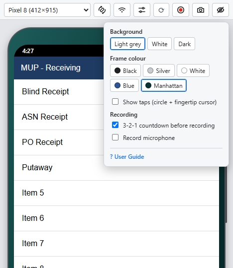
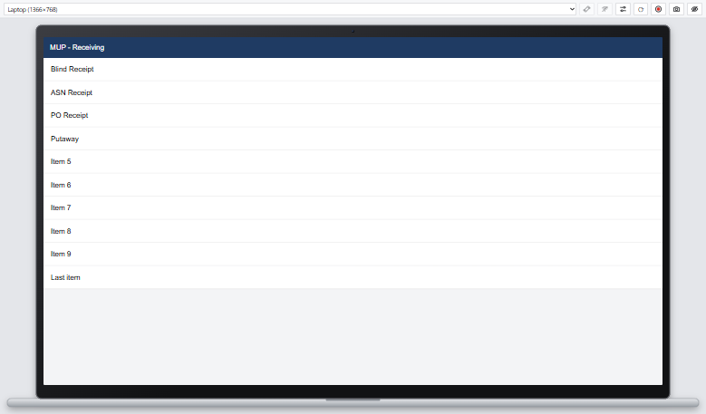

# Device Frame – User Guide

Device Frame is a Chrome extension that shows a web page inside a phone,
handheld, laptop, or plain screen, so you can demo it, take screenshots, and
record videos. It replaces the device frame Chrome DevTools used to have.

---

## 1. Install

1. Download the latest zip:
   **https://github.com/sidmsmith/device-frame-extension/releases/latest/download/device_frame_extension.zip**
2. Extract it to a permanent folder **outside OneDrive**, e.g.
   `C:\Users\<your name>\device_frame_extension`. Check that `manifest.json`
   is directly inside that folder.
3. In Chrome, open `chrome://extensions` and turn on **Developer mode** (top right).
4. Click **Load unpacked** and select the folder.
5. Pin **Device Frame** from the puzzle-piece menu so its phone icon is in the toolbar.

**Updating:** download the zip again, replace the folder's files, then click
the reload icon on the Device Frame card in `chrome://extensions`. Close any
open frame windows and open them again.

## 2. Open a page in a frame

Go to the page you want to show (for WM Mobile: open **WM Mobile** from the
WMS menu), then click the **Device Frame** icon in the Chrome toolbar. A
separate window opens with the page inside the device. It works exactly like
the normal page: same login, same data.

The window remembers its position, device, and settings. Close the window
when you're done.

## 3. The control bar

| Icon | Name | What it does |
|---|---|---|
| *(dropdown)* | Device | Pick the device or screen size (see section 4). |
|  | Edit size | Shown when **Custom** is selected: change the custom width × height. |
|  | Delete | Shown when a **Saved** device is selected: click twice to delete it. |
|  | Rotate | Switch between portrait and landscape (phones and tablets only). |
|  /  | Status bar | Show / hide an Android status bar (clock, signal, Wi-Fi, battery). Slashed = hidden. |
|  | Settings | Background, frame colour, tap indicator, countdown, microphone (see section 5). |
|  | Reload | Reload the page (F5 also works). |
|  | Record | Record a video of the device (see section 7). Turns red with a timer while recording; click again to stop. |
|  | Screenshot | Picture of the device: copied to the clipboard **and** saved to Downloads (see section 6). |
|  | Hide toolbar | Hide this bar for a clean screen (see section 8). |

Hover over any button to see a short description. This guide is also one
click away: **Settings**  → **? User Guide**.

## 4. Devices and screen sizes

The device dropdown has three sections:

- **Mobile** – Android Tablet, Galaxy S24, Moto G4, Pixel 8, Rugged Handheld
  (with keypad and scan triggers), Zebra TC52.
- **Full Screen** – for laptop/PC/fixed-station screens:
  - **Laptop (1366×768)** – the page inside a laptop frame.
  - **Desktop (no frame, 1920×1080)** – just the screen, no frame at all.
    Use this to record or screenshot normal desktop WMS screens.
- **Saved** – your own named sizes (only shown once you've saved one).

**Custom…** (at the bottom) lets you type any width × height (240–2560).
Press **Enter** or **Apply** to use it. To keep it for later, click **Save…**,
type a name (e.g. *Zebra TC21*), and press Enter – it appears under **Saved**.

Good to know:

- The numbers are the screen size the page sees (like DevTools), not physical pixels.
- If a device is bigger than your monitor, the window automatically zooms
  out to fit. The page still lays out at the full size.
- Laptop and Desktop are always landscape and have no status bar, so those
  buttons are greyed out.

## 5. Settings panel

Click  to open it; click anywhere else to close it.

- **Background** – Light grey (default), White, or Dark. This is the area
  around the device.
- **Frame colour** – Black, Silver, White, Blue, or Manhattan. (The Zebra,
  Rugged Handheld, and Desktop keep their own look.)
- **Show taps** – shows a soft circle wherever you click, plus a round
  fingertip cursor. Great for screen-shared demos and recordings, so viewers
  can see what you tapped.
- **3-2-1 countdown before recording** – on by default; untick to start
  recording immediately.
- **Record microphone** – include your voice in recordings (see section 7).
- **? User Guide** – opens this guide in a new tab.

All settings are remembered.

## 6. Screenshots

- Click  – the device is **copied to the clipboard**
  and **saved to Downloads** as a PNG.
- Or press **Alt+Shift+S** – copies to the clipboard only (no file).

Screenshots have a **transparent background** (just the device), so they paste
cleanly into PowerPoint, Teams, or Outlook.

## 7. Recording videos

**Start:**
- Press **Alt+Shift+V** (recommended) – starts straight away, no prompt.
- Or click  – Chrome first asks you to share the tab; click **Share**.

A **3, 2, 1** countdown runs (unless you turned it off), then recording starts.
The record button turns red and shows the elapsed time.

**Stop:** press **Alt+Shift+V** again, or click the red  button.
The video is saved to **Downloads** as an **MP4** (plays in PowerPoint, Teams, Outlook).

Tips:

- Only the device is recorded – not the control bar.
- Turn on **Show taps** so viewers can see where you clicked (the mouse
  pointer itself isn't recorded).
- The video is a rectangle, so the **background colour** shows in the corners
  around a phone. Pick the background that matches your slides (e.g. White)
  before recording. In PowerPoint you can also use **Video Format → Video
  Shape → Rounded Rectangle** to trim the corners.
- While recording, the device/rotate/settings/hide controls are locked so the
  video can't change size.
- A full page reload (e.g. logging in again) ends the recording; moving
  around inside the app is fine.

**Microphone:** tick **Record microphone** in the settings panel. The first
time, Chrome asks for microphone permission – choose **Allow on every visit**.
While recording with sound, a small  appears on the red button. If the
microphone is blocked or missing, you'll see a message and the video is
recorded without sound.

## 8. Hiding the toolbar

Click  to hide the bar for a clean, minimal window. To bring it back:

- **double-click** the device frame or the background around it,
- press **Alt+Shift+H**, or
- move the mouse to the top edge of the window and click the small tab  that appears.

## 9. Keyboard shortcuts

| Shortcut | Does |
|---|---|
| **Alt+Shift+V** | Start / stop recording (no share prompt) |
| **Alt+Shift+S** | Copy a screenshot to the clipboard |
| **Alt+Shift+H** | Hide / show the toolbar |

Shortcuts only act in the frame window. To change them, go to
`chrome://extensions/shortcuts`. (Avoid **Alt+Shift+R** – Chrome uses it for
Reading mode.)

## 10. Troubleshooting

| Problem | Fix |
|---|---|
| "Manifest file is missing or unreadable" when loading | Select the folder that has `manifest.json` directly inside it (not a parent folder), and keep it **outside OneDrive**. |
| Clicking the toolbar icon does nothing | It only works on normal web pages (`http`/`https`), not on `chrome://` pages. |
| A shortcut does nothing | Check `chrome://extensions/shortcuts` – Chrome sometimes leaves a new shortcut blank; set it there. |
| A shortcut types a letter into the page | Close the frame window and open it again (needed once after installing or updating). |
| "Recording failed: …" | Try the record button instead of the shortcut, and send the message text to whoever maintains the extension. |
| "Clipboard copy blocked" | The PNG was still saved to Downloads. Click inside the frame window first, then try again. |
| A strange text-only view appeared | That's Chrome's Reading mode (Alt+Shift+R) – click the ✕ to close it. |
